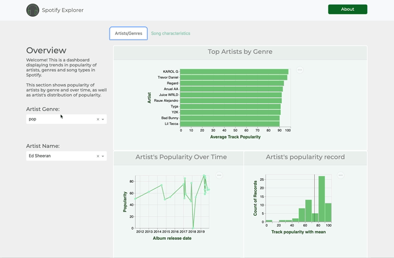

# spotify-explorer-py

Spotify Explorer is a dashboard implemented in Dash in order to help business analysts, product content managers visualize and understand the current trends in the music industry through the Spotify dataset. 

## Dashboard description

The app contains a landing page that shows 4 graphs and a single tool box for controlling the graphs individually and together.

- Top artists with an average popularity score filtered by Genre 
    * Here the user can select a particular `genre` of music by using the drop down list for genre located on the left hand side of the dashboard. 
    * The plot shows the artist and their corresponding popularity score for the specific genre.
- Popularity Trend of Specific Artists across time
    * The user on choosing a specific artist from a different down drop list, will be provided with a line chart of the artist's average popularity score over the years.
- Popularity Distribution of Specific Artists 
    * Based on the artist chosen from the previous drop down list, this plot will show the distribution of the Artist's popularity score. This helps the user identify the artist's popularity score across their songs.
- Popular Song Characteristics
    * Finally, a seperate drop down list for song characteristics help users choose from a list of attributes such as `loudness`, `danceability`, etc. The plot then shows the relationship of the chosen attribute with `popularity` through a scatter plot.

All plots have interactivity embedded in them which help users zoom in, crop and hover around data points in the plots. 

## Proposed Design Layout

## Contributors

- Christopher Alexander 
- Jennifer Hoang
- Thea Wenxin
- Michelle 

## Contributing

Interested in contributing? Check out the contributing guidelines. Please note that this project is released with a [Code of Conduct](https://github.com/UBC-MDS/spotify-explorer-py/blob/main/CODE_OF_CONDUCT.md). By contributing to this project, you agree to abide by its terms.

## License

`spotify-explorer-py` was created by Christopher Alexander, Jennifer Hoang, Thea Wenxin and Michelle. It is licensed under the terms of the [MIT License](https://github.com/UBC-MDS/spotify-explorer-py/blob/main/LICENSE).

